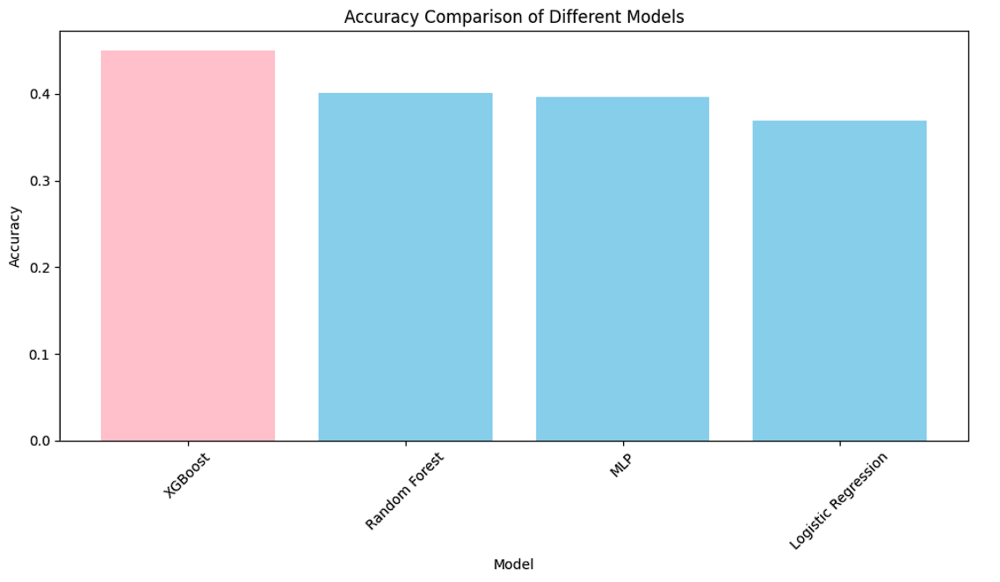

# Mini-Project for Fundamentals of Machine Learning Course

This repository contains the code and data for a mini-project on facial expression recognition using machine learning algorithms.

## 📑 Project Policy

- Team: group should consist of 3-4 students.
  | No. | Student Name         | Student ID |
  | --- | -------------------- | ---------- |
  | 1   | Hồ Quốc Tuấn      | 21110435   |
  | 2   | Nguyễn Chí Lương | 21110337   |
  | 3   | Phạm Đức Mạnh    | 21110341   |
- The submission deadline is strict: **11:59 PM** on **June 22nd, 2024**. Commits pushed after this deadline will not be considered.

## 📦 Project Structure

The repository is organized into the following directories:

- **/data**: This directory contains the facial expression dataset. You'll need to download the dataset and place it here before running the notebooks. (Download link provided below)
- **/notebooks**: This directory contains the Jupyter notebook ``EDA.ipynb``. This notebook guides you through exploratory data analysis (EDA) and classification tasks.

## ⚙️ Usage

This project is designed to be completed in the following steps:

1. **Fork the Project**: Click on the ``Fork`` button on the top right corner of this repository, this will create a copy of the repository in your own GitHub account. Complete the table at the top by entering your team member names.
2. **Download the Dataset**: Download the facial expression dataset from the following [link](https://mega.nz/file/foM2wDaa#GPGyspdUB2WV-fATL-ZvYj3i4FqgbVKyct413gxg3rE) and place it in the **/data** directory:
3. **Complete the Tasks**: Open the ``notebooks/EDA.ipynb`` notebook in your Jupyter Notebook environment. The notebook is designed to guide you through various tasks, including:

   1. Prerequisite
   2. Principle Component Analysis
   3. Image Classification
   4. Evaluating Classification Performance

   Make sure to run all the code cells in the ``EDA.ipynb`` notebook and ensure they produce output before committing and pushing your changes.
4. **Commit and Push Your Changes**: Once you've completed the tasks outlined in the notebook, commit your changes to your local repository and push them to your forked repository on GitHub.

Feel free to modify and extend the notebook to explore further aspects of the data and experiment with different algorithms. Good luck.

## Contents

Data set:

The data consists of grayscale images of faces, each measuring 48x48 pixels. The faces have been automatically aligned to be roughly centered and occupy a similar area within each image. The task is to categorize each face based on the emotion expressed, assigning it to one of seven categories (0=Angry, 1=Disgust, 2=Fear, 3=Happy, 4=Sad, 5=Surprise, 6=Neutral). The dataset contains a total of 35,887 examples.

# 1. Prerequisites

## Import Required Libraries

Import essential libraries such as pandas, numpy, and matplotlib.pyplot.

## Define Functions

- parse_data()

A function to read the dataset and return arrays of images and labels.

- show_img()

A function to visualize the images with their respective labels.

## Usage

1. Load the Data

- Mount your Google Drive to access the dataset.
- Load the dataset using `pandas`.

2. Extract Data

- Use the `parse_data()` function to convert the data into arrays of images and labels.

3. Visualize the Extracted Data

- Use the `show_img()` function to display the images along with their labels.

# 2. Principal Component Analysis
Unsupervised learning includes tasks like data transformation and clustering. This section focuses on data transformation using techniques from unsupervised learning, aimed at modifying data for easier analysis by both computers and humans.

## Introduction to PCA
Unsupervised data transformation often involves dimensionality reduction, which simplifies complex datasets by reducing their number of features. Principal Component Analysis (PCA) is a popular technique for this purpose. It transforms data into principal components (PCs), which capture the most significant variations in the data, allowing for substantial size reduction while retaining critical information.

## Usage
1. Visualizing Data Projection:

- Use PCA to project data onto two principal components.
- Plot the resulting projection using a scatter plot to visualize data distribution.  

2. Determining Optimal Number of Principal Components:

- Calculate and plot the cumulative explained variance against the number of principal components.
- Identify the point where the cumulative explained variance reaches a desired threshold, typically 95%.
- Choose the smallest number of principal components that explain at least 95% of the variance.  

## Explanation
- Fit the PCA Model: Compute the explained variance ratio for each principal component.
- Cumulative Explained Variance: Summarize the variance retained as additional components are included.
- Select Optimal Components: Determine the number of principal components that strike a balance between dimensionality reduction and information retention.

# 3. Image Classification
The image classification task involves comparing the performance of different classification algorithms using two formats of data:

- Original data: Data before applying PCA.
- Transformed data: Data projected onto the optimal number of principal components identified in the previous section.
## Overview
This section evaluates the performance of four distinct classification algorithms, including three traditional machine learning models and one MLP (Multi-Layer Perceptron) model. The evaluation is conducted using both the original and transformed datasets to analyze the impact of PCA on classification accuracy.

## Steps
### Original Data
1. Data Preparation:

- Split the dataset into training and testing sets using train_test_split().
- Resize images to a smaller size (24x24) to facilitate CNN feature extraction.
2. Feature Extraction with CNN:

- Build a Convolutional Neural Network (CNN) model for feature extraction.
- Compile and train the CNN model using categorical_crossentropy loss.
3. Extract and Scale Features:

- Extract features from the CNN model for both training and testing sets.
- Scale the extracted features using StandardScaler().
4. Model Selection and Hyperparameter Tuning:

- Define four classification models: Logistic Regression, XGBoost, Random Forest, and MLP.
- Specify hyperparameter grids for each model using GridSearchCV().
5. Grid Search and Evaluation:

- Perform hyperparameter tuning using GridSearchCV() with 5-fold cross-validation.
- Evaluate each model's performance using metrics like accuracy, precision, recall, and F1-score.
### Transformed Data with PCA
1.Flatten the Images for PCA:

- Flatten the images for PCA transformation (X_train_flat and X_test_flat).
2. Apply PCA:

- Apply PCA with 255 principal components (n_components=255).
- Transform the flattened images using PCA (X_train_pca and X_test_pca).
3. Scale the Data:

- Scale the PCA-transformed data (X_train_scaled and X_test_scaled).
4. Model Selection and Hyperparameter Tuning:

- Define the same four classification models as used with original data.
- Specify hyperparameter grids for each model using GridSearchCV().
5. Grid Search and Evaluation:

- Perform hyperparameter tuning using GridSearchCV() with 5-fold cross-validation.
- Evaluate each model's performance using metrics like accuracy, precision, recall, and F1-score.
## Usage
1. Clone the Repository:

- Clone the project repository to your local machine.
2. Install Dependencies:

- Ensure all necessary libraries are installed, including scikit-learn, xgboost, tensorflow, and others listed in the code.
3. Run the Code:

- Execute the provided code sections sequentially in a Python environment that supports Jupyter notebooks or Python scripts.
## Notes
- Parallel Processing: Utilize parallel_backend for parallel processing during grid search to speed up hyperparameter tuning.
- Model Evaluation: Collect and compare metrics such as accuracy, precision, recall, and F1-score for each model on both original and transformed datasets.
- Inspiration: Refer to the scikit-learn documentation example for guidance on hyperparameter tuning and model evaluation.

# 4. Evaluation Classification Performance
This section focuses on evaluating the classification performance of different models. It includes comparing the performance of models trained on both original data and PCA-transformed data, identifying the best-performing model, and visualizing the results.

## Overview
The evaluation process involves:

- Identifying the best model based on accuracy.
- Visualizing the accuracy of different models.
- Analyzing the confusion matrix to determine which emotion categories are predicted most accurately and which have the most errors.
## Steps
1. Compare Performance and Identify Best Model:

- Define a function display_best_model(metrics_df) to find and display the model with the highest accuracy and its associated metrics.
2. Visualize Model Performance:

- Define a function plot_model_accuracies(metrics) to create a bar chart comparing the accuracy of different models.
3. Evaluate with Original Data:

- Use display_best_model(metrics_ori_df) to display the best model trained on the original data.
- Use plot_model_accuracies(metrics_ori) to visualize the performance of models trained on the original data.
4. Evaluate with PCA Data:

- Use display_best_model(metrics_pca_df) to display the best model trained on the PCA-transformed data.
- Use plot_model_accuracies(metrics_pca) to visualize the performance of models trained on the PCA-transformed data.
5. Analyze Confusion Matrix:

- Calculate and print the emotion category where the model makes the most accurate predictions and the category with the most errors.
## Usage
1. Clone the Repository:

- Clone the project repository to your local machine.
2. Install Dependencies:

- Ensure all necessary libraries are installed, including pandas, numpy, matplotlib, scikit-learn, and others listed in the code.
3. Run the Code:

- Execute the provided code sections sequentially in a Python environment that supports Jupyter notebooks or Python scripts.
## Notes
- Model Evaluation: Compare the accuracy, precision, recall, and F1-score of different models to identify the best performer.
- Visualization: Use bar charts to visualize the accuracy of different models for easy comparison.
- Emotion Analysis: Use the confusion matrix to analyze which emotion categories are predicted most accurately and which have the most errors, providing insights into the model's performance on specific classes.

## Conclusion
In this project, we evaluated the performance of several classification models on both original and PCA-transformed datasets.

Best Model: XGBoost

Accuracy: 44.98%
Precision: 45.61%
Recall: 44.98%
F1-Score: 43.82%

## Explain
In our analysis, XGBoost emerged as the best model for facial emotion recognition, outperforming other models in terms of accuracy, precision, recall, and F1-score. This performance can be attributed to several key factors:

- Handling Non-linear Data: XGBoost excels at capturing complex, non-linear relationships within data, which is crucial for the intricate patterns in facial emotion recognition.

- Regularization Techniques: With built-in regularization (L1 and L2), XGBoost effectively mitigates overfitting, ensuring better generalization to new data.

- High Efficiency: Known for its computational efficiency, XGBoost leverages both CPU and GPU capabilities, optimizing both training and prediction times.

- Ensemble Learning: By combining multiple weak learners into a strong learner, XGBoost enhances prediction accuracy and robustness.

- Imbalanced Data Handling: XGBoost can adjust to imbalanced datasets by assigning different weights to classes, improving prediction for less represented emotions.

These features make XGBoost particularly well-suited for the challenges of facial emotion recognition, explaining its superior performance in our project.
